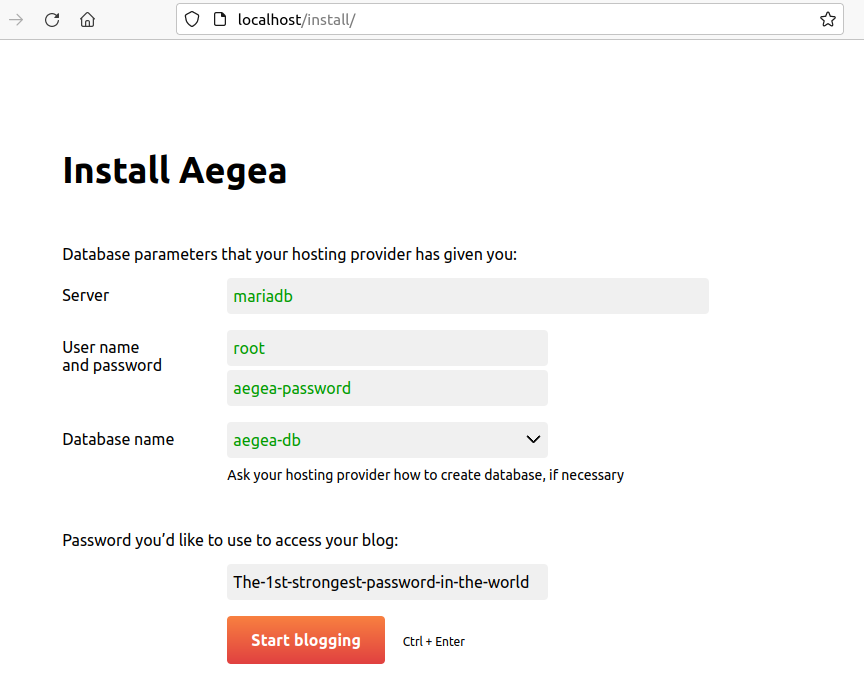

# Aegea, the blogging engine (dockerized)

Official web page: [EN](http://blogengine.me/) / [RU](https://blogengine.ru)


The official way to install Aegea is to unpack the php code of the engine onto a preconfigured server with apache and php installed. Which, however, is not an optimal method for home use.

This repository contains the necessary tools and instructions to install the Aegea engine easily to a home server or a cloud instance using docker.

Two installation options are offered: using a pre-built image, or building the image by yourself.

> This container plays nicely with https://github.com/jwilder/nginx-proxy nginx docker container.

## Basic usage (pre-built image)

1. Create `.env` file:
    ```ini
    AEGEA_VERSION=latest
    VIRTUAL_HOST=localhost
    PORT=80
    MYSQL_DATABASE=aegea-db
    MYSQL_ROOT_PASSWORD=aegea-password
    UID=1000
    GID=1000
    ```

1. Create `docker-compose.yml` file:
    ```yaml
    version: "3"

    services:
    mariadb:
        container_name: aegea-db
        image: mariadb
        restart: unless-stopped
        environment:
        MYSQL_DATABASE: ${MYSQL_DATABASE}
        MYSQL_ROOT_PASSWORD: ${MYSQL_ROOT_PASSWORD}
        volumes:
        - ./data/mysql:/var/lib/mysql:delegated

    blog:
        container_name: aegea-blog
        image: 13rom/aegea:${AEGEA_VERSION}
        restart: unless-stopped
        environment:
        VIRTUAL_HOST: ${VIRTUAL_HOST}
        depends_on:
        - mariadb
        ports:
        - ${PORT}:80
        user: "${UID}:${GID}"
        volumes:
        #- ./data/themes:/var/www/html/themes:delegated
        - ./data/pictures:/var/www/html/pictures:delegated
        - ./data/user:/var/www/html/user:delegated
    ```
1. Run:
    ```bash
    mkdir -p data/{pictures,user}
    docker compose up -d
    ```

1. Open your browser and navigate to:
    ```
    http://localhost:80
    ```

1. Continue the installation:

    


## Advanced usage
### Just build the image
1. Navigate to the project directory, then run:

    ```sh
    docker build . --build-arg AEGEA_VERSION=$(AEGEA_VERSION) -t $(DOCKER_IMAGE)
    ```
    Remember to replace `$(AEGEA_VERSION)` and `$(DOCKER_IMAGE)` with corresponding values.


### Build the image and deploy it

1. Navigate to the project directory and copy `example.env` → `.env`. Make changes to `.env` to customize your deployment.

    After that run:
    ```sh
    docker compose up -d
    ```

1. Open your browser, navigate to:
    ```
    http://localhost
    ```
    > assuming that VIRTUAL_HOST=localhost and PORT=80

1. Continue on Aegea installation page

---
This docker-compose.yml is configured to store user data on host machine in the following directories:

- `./data/mysql`
- `./data/pictures`
- `./data/user`

This approach allows to persist blog data between container recreation.