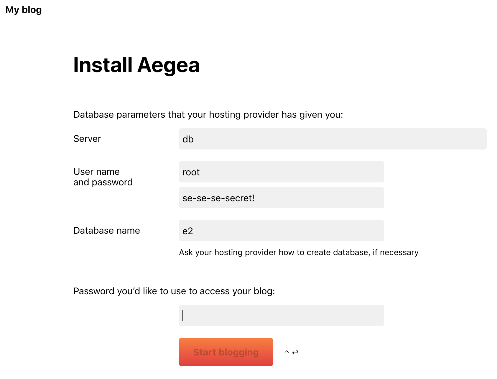

# Aegea — Lightweight blog engine (dockerized)

Official web page: [RU](https://blogengine.ru) or [EN](http://blogengine.me/).

This container plays nicely with https://github.com/jwilder/nginx-proxy nginx docker container.

## Basic usage

Navigate to the project directory and copy `example.env` → `.env`, then change values in the last one (optional).
After that run:

    docker-compose up -d

Open http://localhost (if you changed `PORT` value in `.env` file to something else, specify this port implicitly, for ex.: http://localhost:8080) in browser and fill configuration form with the values from `.env` file.
**Replace `localhost` → `db` in "server" field.**

This docker-compose.yml is configured to store user data on host machine in the following directories:

- `./data/mysql`
- `./data/pictures`
- `./data/themes`
- `./data/user`

This approach allows to persist blog data between container recreation.

## Build

Default Aegea version is 3254. If you want to change the version, run the following command:

    docker-compose build --build-arg VERSION=<NEW_BERSION_NUMBER>
